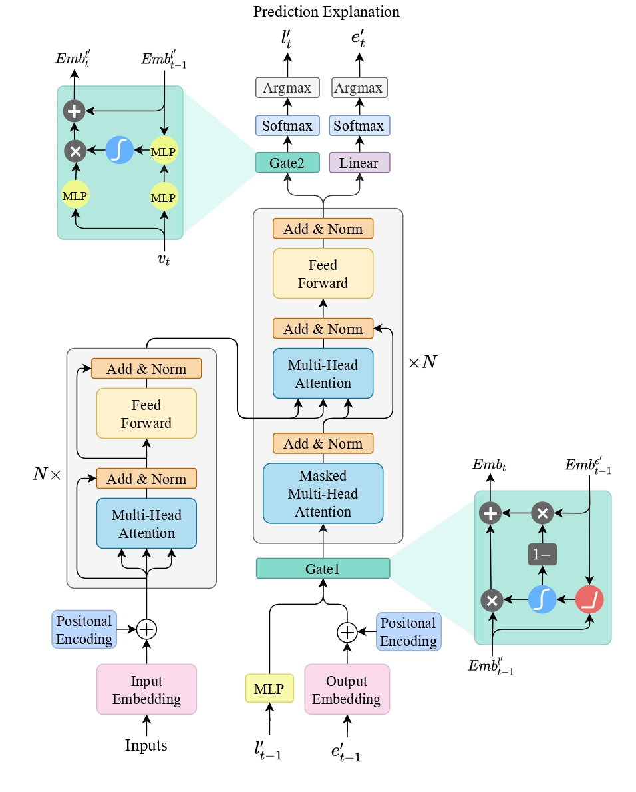

# MPII: Multi-Level Mutual Promotion for Inference and Interpretation


<p align="center">
  
</p>


This is a PyTorch implementation of [MPII: Multi-Level Mutual Promotion for Inference and Interpretation(https://aclanthology.org/2022.acl-long.488/).

## Introduction
This project helps you reproduce the results in our work, including the ablation study.

## Installation
Clone the repo and install required packages.
```bash
pip install -r requirements.txt
```

## Train
### Transformer + MPII (w/o AFiRe)
```bash
CUDA_VISIBLE_DEVICES=0 \
python train_nli.py \
-data data_path \
-save_model outputs \
-share_embeddings \
-layers 6 -rnn_size 1024 -word_vec_size 1024 \
-transformer_ff 4096 -heads 8  \
-encoder_type transformer \
-decoder_type transformer -position_encoding \
-train_steps 200000  -max_generator_batches 0 \
-dropout 0.1 -batch_size 2048 \
-batch_type tokens -normalization tokens \
-optim adam -adam_beta1 0.9 -adam_beta2 0.998 \
-decay_method none -learning_rate 0.0001 \
-max_grad_norm 0 -param_init 0 \
-param_init_glorot -label_smoothing 0.1 \
-valid_steps 5000 -save_checkpoint_steps 5000 \
-world_size 1 -gpu_ranks 0 \
-dynamic_gen_prob 0.5
```

### Transformer + MPII
```bash
CUDA_VISIBLE_DEVICES=0 \
python train_nli_gan.py \
-data data_path \
-save_model outputs \
-share_embeddings \
-layers 6 -rnn_size 1024 -word_vec_size 1024 \
-transformer_ff 4096 -heads 8 \
-encoder_type transformer \
-decoder_type transformer -position_encoding \
-train_steps 200000  -max_generator_batches 0 \
-dropout 0.1 -batch_size 2048 \
-batch_type tokens -normalization tokens \
-optim adam -adam_beta1 0.9 -adam_beta2 0.998 \
-decay_method none -learning_rate 0.0001 \
-max_grad_norm 0 -param_init 0  \
-param_init_glorot -label_smoothing 0.1 \
-valid_steps 5000 -save_checkpoint_steps 5000 \
-world_size 1 -gpu_ranks 0 \
-dynamic_gen_prob 0.5 \
-critic_steps 10 -ap_critic_steps 10
```

### BART + MPII
```bash
CUDA_VISIBLE_DEVICES=0 python train_with_bart.py \
-workdir outputs \
-bart_dir bart/bart.large \
-data_dir cos-e/processed/bart_format_aug \
-batch_size=8 -lr=0.00001
```

## Test
```bash
CUDA_VISIBLE_DEVICES=0 bash ./single_test.sh model_dir batch_size model_step
```

## Results
Here provides the results of MPII for NLI and CQA tasks.
*: from MPII paper.

| Methods      | Inference | Interpretation | Linear | Attentive |
| ---------- | ---------------- | ------ | ------ | --------- |
|              | Task-Accuracy | BLEU | PPL | Inter-Rep |
|              |  | NLI Task |  |  |
| e-INFERSENT | 83.96      | 22.40   | 24   | 0.72      |
| Transformer   | 80.12    | 23.63    | 68   | 0.69      |
| Transformer + MPII (w/o AFiRe)* | 86.47 | 27.93 | 41 | 0.64
| Transformer + MPII*   | 87.32     | 28.64    | 37   | 0.52    |
| BART + MPII*    | 91.85    | 31.26   | 27   | 0.51     |
|              |  | CQA Task |  |  |
| CAGE | 58.15      | 4.37   | 129   | 0.36     |
| BART + MPII*  | 60.21      | 4.92   | 196   | 0.15     |


## Citation
```bibtex
@inproceedings{liu-etal-2022-mpii,
    title = "{MPII}: Multi-Level Mutual Promotion for Inference and Interpretation",
    author = "Liu, Yan  and
      Chen, Sanyuan  and
      Yang, Yazheng  and
      Dai, Qi",
    booktitle = "Proceedings of the 60th Annual Meeting of the Association for Computational Linguistics (Volume 1: Long Papers)",
    month = may,
    year = "2022",
}
```

